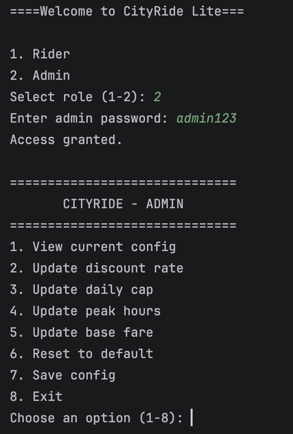
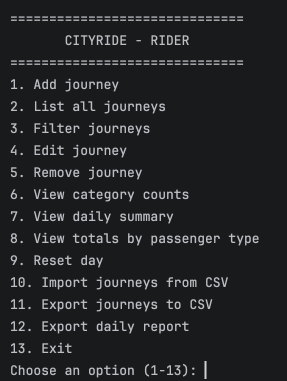
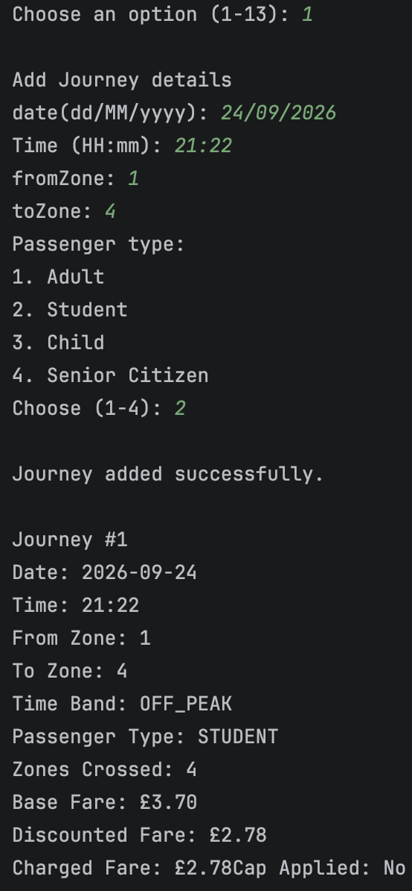
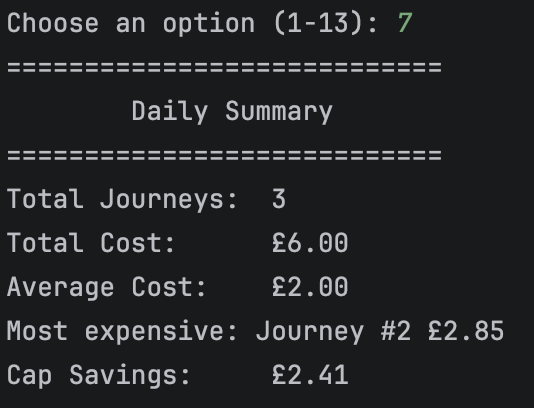
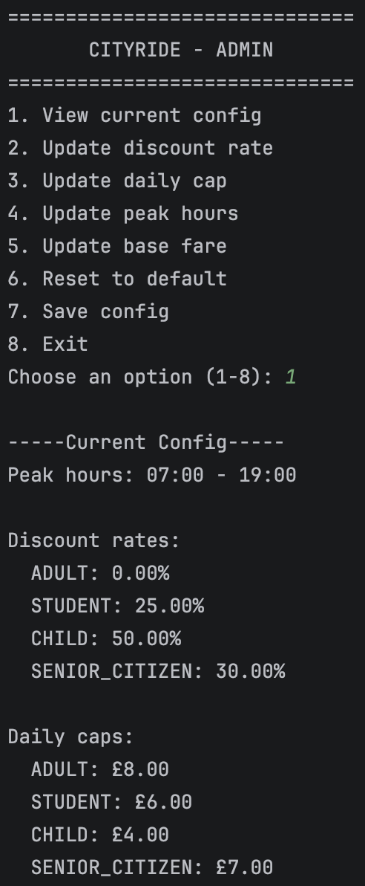

# CityRide Lite

A console-based public transport fare management system written in **Java**.

CityRide Lite simulates a zone-based transit fare system with two roles: a **Rider**, who logs journeys and gets charged an automatically calculated fare, and an **Admin**, who configures the fare rules the riders are charged under. Fares depend on the zones travelled between, whether the journey happened during peak or off-peak hours, and the passenger's discount category — with a daily spending cap that kicks in once a rider has paid enough for the day. Journeys, rider profiles and fare configuration can all be saved to and loaded from disk, so a rider's data and an admin's settings persist between runs.

I built this as a university coursework project to practise Java OOP — journeys, fare rules, file handling and the two user-facing services are all separate classes, so the fare logic, the persistence layer and the menus don't depend on each other's internals.

---

## 📖 Table of Contents

- [Features](#-features)
- [Built With](#-built-with)
- [Usage](#-usage)
- [Screenshots](#-screenshots)
- [Installation](#-installation)
- [Project Structure](#-project-structure)

---

## ✨ Features

- **Rider & Admin roles** — a Rider menu for logging journeys, and a password-protected Admin menu for setting the fare rules everyone else is charged under.
- **Zone-, time- and passenger-based fares** — every journey's fare depends on the from/to zone pair (1–5), whether it falls inside or outside a configurable peak-hours window, and the passenger's discount category (Adult, Student, Child, Senior Citizen).
- **Daily spending cap** — each passenger type has its own daily cap; once a rider's charged total for the day reaches it, further journeys cost £0, and a journey that would cross the cap is only charged up to it.
- **Rider profiles** — name, passenger type and default payment method, loaded on login or created fresh, and saved to disk on exit.
- **Full journey management** — add, list, edit, remove and filter journeys (by passenger type, time band, zone or date), with fares and totals automatically recalculated whenever a journey is edited or removed.
- **Summaries & stats** — a daily summary (total/average cost, most expensive journey, cap savings), running totals per passenger type, and category counts broken down by time band and zone pair.
- **CSV import/export** — bring journeys in from a CSV file or export the current list back out.
- **End-of-day reports** — generate a full text report and a CSV report for a rider's day in one go, saved to a `reports/` folder.
- **Admin configuration** — view the current config, update discount rates, daily caps, peak hours or individual zone-pair base fares, and reset any single value (or everything) back to its default.
- **Persistent config** — all fare rules are saved to and loaded from a JSON file, so admin changes carry over between runs.

---

## 🛠️ Built With

- **Java**
- **Gson** — JSON serialisation for saving/loading config and rider profiles
- **java.math.BigDecimal** — precise fare calculations
- **java.time** (`LocalDate`, `LocalTime`) — journey dates, times and peak-hour comparisons
- Standard Java I/O for CSV and text report files

---

## 🎮 Usage

On startup, pick a role from the main menu:

- **Rider (1)** — load your existing profile from `profile.json` or create a new one, then land on the rider menu.
- **Admin (2)** — log in with the admin password, then land on the admin menu.

**As a Rider**, the menu lets you add a journey (enter date, time, zones and passenger type — the fare is worked out for you), list/filter/edit/remove journeys, check category counts or the daily summary, view totals by passenger type, reset the day, import/export journeys via CSV, and export a full end-of-day report. On exit you're asked whether to save your profile and journeys.

**As an Admin**, the menu lets you view the current config, update discount rates/daily caps/peak hours/base fares, reset any of those back to default, and save the config.

---

## 📸 Screenshots

<!-- Add screenshots to a docs/ folder and update the paths below -->

### Role Selection



### Rider Menu



### Adding a Journey



### Daily Summary



### Admin Menu / Config



---

## 💻 Installation

### Requirements

- **JDK 17** or later
- **Maven** (dependencies, including Gson, are managed automatically via `pom.xml`)

### 1. Clone the repository

```bash
git clone https://github.com/T0485902Vladyslav/cityride-lite.git
cd cityride-lite
```

### 2. Build

```bash
mvn package
```

This downloads Gson and packages everything into a single runnable jar at `target/cityride-lite.jar`.

### 3. Run

```bash
java -jar target/cityride-lite.jar
```

> **Note:** Config, profile, journey CSV and report files are created in the working directory (and a `reports/` folder) the first time they're saved.

---

## 🗂️ Project Structure

| Component            | Responsibility                                                                                                    |
| --------------------- | ------------------------------------------------------------------------------------------------------------------ |
| `CityRideSystem`      | Entry point; loads config, wires up the shared services and lets the user pick the Rider or Admin role             |
| `RiderService`        | Rider-facing menu — add/list/edit/remove/filter journeys, summaries, CSV import/export, report export, profile save |
| `AdminService`        | Password-protected admin menu — view and update fare rules, reset values to default, save config                   |
| `Journey`             | Represents a single logged journey, including zones, time band, passenger type and the three fare values           |
| `JourneyManagement`   | Owns the list of journeys and running passenger totals; handles add/remove/edit, filtering and recalculation        |
| `PassengerTotals`     | Running per-passenger-type totals (pre-discount, discounted, charged) and whether the daily cap has been reached    |
| `DailySummary`        | Computes total/average cost, most expensive journey, cap savings and category counts for a set of journeys          |
| `FareCalculator`      | Applies discount rates and the daily cap rule, and builds fully-priced `Journey` objects                            |
| `SystemConfig`        | Stores base fares, discount rates, daily caps and peak hours, with load/save defaults and per-value resets          |
| `FileHandler`         | Abstract base class for file I/O, extended by `JsonFileHandler` and `CsvFileHandler`                                |
| `JsonFileHandler`     | Reads/writes `SystemConfig` and `RiderProfile` as JSON via Gson                                                     |
| `CsvFileHandler`      | Imports/exports journeys as CSV rows                                                                                |
| `RiderProfile`        | Stores a rider's name, passenger type and default payment method                                                    |
| `ReportExporter`      | Writes end-of-day reports as a text summary and a CSV file into `reports/`                                          |
| `InputReader`         | Validates and re-prompts for all console input (menu choices, dates, times, zones, yes/no, decimals)                |

---

*Developed in Java as a console-based fare management system featuring zone- and time-based pricing, passenger discounts, daily fare capping, rider/admin roles, and JSON/CSV persistence.*
